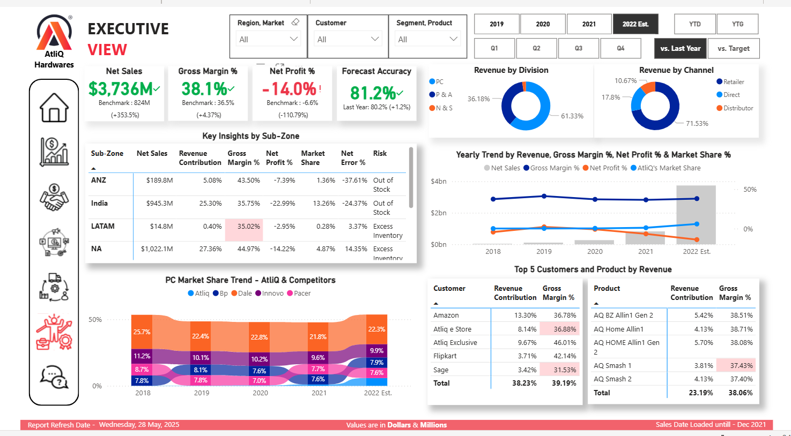

# Business Insights 360 - AtliQ Harwares

---

### Power BI Dashboard - 

---
AtliQ Hardware, a fast-growing consumer electronics company, is facing challenges in keeping up with competitors when it comes to leveraging data. My goal is to implement an advanced analytics solution using Power BI that will enable the company to make data-informed decisions. 

This project aims to develop a comprehensive report that can serve the needs of stakeholders across Sales, Marketing, Finance, and the Executive team.

---

## Datasets Overview

This project involves various datasets divided into dimension tables, fact tables, and cost & pricing data. Below is a summary of each.

### Dimension Tables (Static Data)

- **dim_customer:**  
  Contains customer details, markets, and sales channels.

- **dim_market:**  
  Defines market hierarchies, including regions and sub-zones.

- **dim_product:**  
  Lists product categories and their variants.

### Fact Tables (Transaction Data)

- **fact_forecast_monthly:**  
  Stores monthly customer demand forecasts to support cost control and improve customer satisfaction.

- **fact_sales_monthly:**  
  Records actual monthly sales, structured similarly to the forecast data.

### Cost and Pricing Data

- **freight_cost:**  
  Shows travel expenses broken down by market and fiscal year.

- **gross_price:**  
  Provides gross prices at the product level.

- **manufacturing_cost:**  
  Tracks production costs by product and year.

- **pre_invoice_deductions:**  
  Contains customer-specific deductions applied before invoicing.

- **post_invoice_deductions:**  
  Captures other deductions applied after invoicing.

---

## Data Modeling Method

### ❄️ Snowflake Schema

The data model follows a snowflake schema, organized as:

- **Fact Tables:**
  - `fact_sales_monthly`: Stores transactional sales records.
  - `fact_forecast_monthly`: Holds forecast data for sales and demand planning.

- **Dimension Tables:**
  - `dim_customer`: Contains customer details, including region and sales platform.
  - `dim_product`: Contains product details such as categories and variants.
  - `dim_market`: Captures market-related data with regional and geographical info.
  - And Other Dimension Table which are needed for analysis are arranged in appropriate manner.

- **Date Table:**
  - A dedicated date table is included to support clear and accurate time-based analysis.

---

## Dashboard Design Overview

### 🏠 Home View

- **Purpose:**  
  Serves as the main entry point, helping users easily navigate to different sections.
- **Elements:**  
  - Navigation buttons for quick access to views like Info, Finance, Sales, Marketing, and more.
  - A clean, user-friendly layout for smooth interaction.

### ℹ️ Info View
- Gives an overview of the project, goals, and approach.
- Includes brief details about the project and the datasets used.
- Provided Company's Performance of Top and Bottom 5 Customers and Products for Intutive Analysis.

### 💰 Finance View
- **KPIs:** Revenue, Profit Margin, Expenses.
- **Visuals:**    
  - Line charts for financial trends.  
  - KPI indicators for at-a-glance metrics.

### 📈 Sales View
- **KPIs:** Sales trends over time, regional sales performance, and forecast accuracy.
- **Visuals:**   
  - Scatter plots for Sales growth arcoss markets.  
  - Comparisons of forecasted vs. actual sales.

### 📣 Marketing View
- **KPIs:** Campaign results, ROI, and conversion rates.
- **Visuals:**  
  - Toggle visual between Gross Margin and Net Profit.
  - Scatter plots comparing marketing spend vs. ROI.

### 🚚 Supply Chain View
- **KPIs:** Inventory levels, freight costs, and delivery efficiency.
- **Visuals:**  
  - KPI indicators for Forecast Accuracy and Net Error. 
  - Line charts on delivery performance.  

### 🏢 Executive View
- Provides top-level KPIs and performance summaries.
- Designed for leadership to quickly grasp overall business health.
- AtliQ vs. Competitors - Market Share Comparison.

### 🛠️ Support View
- Offers help for dashboard users through FAQs and contact info.

---

## Deployment & Maintenance

- Publish the dashboard to **Power BI Service**.
- Set up a **personal gateway** to refresh data automatically.
- Create a **Power BI App** to distribute the report to stakeholders.
- Manage workspace access and permissions for collaboration.

---

## Skills Showcased

### Technical Skills

- Loading and connecting data from MySQL.
- Solid understanding of ETL processes (Extract, Transform, Load).
- Creating date tables using Power Query.
- Calculating fiscal months and quarters.
- Building and managing data model relationships in Power BI.
- Adding and integrating additional data into existing models.
- Writing DAX expressions to create calculated columns.
- Designing effective visuals and dashboards.
- Using merge and append operations for data transformation.
- Publishing to Power BI Service and setting up automatic data refresh.

### Soft Skills

- Strong grasp of business reporting needs.
- Designing reports with a focus on user experience and clear design principles.
- Streamlining and optimizing report creation through detailed refinement.
- Following a structured approach to plan and build reports.
- Familiarity with creating and interpreting project charters.

---
